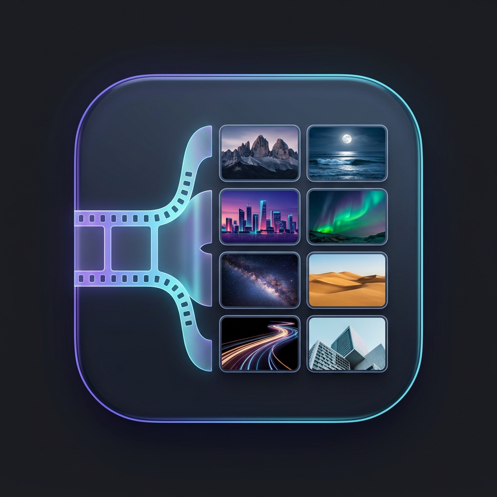

# لقطات | Laqtat

<p align="center">
  
</p>

<p align="center">
  <b>تطبيق متعدد المنصات لاستخراج 8 لقطات مميزة من الفيديو وتجميعها في شبكة صور 4×2 بدون إنترنت وبخصوصية تامة</b><br>
  <b>A cross-platform app to extract 8 keyframes from video and compose them into an elegant 4×2 grid image offline</b>
</p>

<p align="center">
  <a href="#العربية">العربية</a> • <a href="#english">English</a>
</p>

---

<div id="العربية"></div>

# العربية

**لقطات (Laqtat)** هو تطبيق مفتوح المصدر وحديث يعمل على مختلف المنصات (الهواتف، أجهزة سطح المكتب، ومتصفحات الويب)، يقوم بتحليل مقاطع الفيديو واستخراج 8 لقطات زمنية مميزة وموزعة بدقة عبر طول الفيديو، ثم دمجها في صورة شبكية 4×2 فائقة الجمال وجاهزة للحفظ والمشاركة بدون الحاجة إلى أي اتصال بالإنترنت.

---

## لقطات الشاشة

### الصفحة الرئيسية


### شكل التطبيق وشبكة اللقطات


---

## المميزات الرئيسية

- **خصوصية مطلقة وبدون إنترنت (100% Offline)**: لا يتم الاتصال بأي خوادم خارجية أو جمع بيانات أو تحليلات. تظل مقاطع الفيديو وبياناتك على جهازك دون مغادرته إطلاقاً.
- **دعم واسع لصيغ الفيديو**: يدعم أكثر من 20 صيغة فيديو (`mp4`, `mov`, `mkv`, `webm`, `avi`, `flv`, `f4v`, `wmv`, `m4v`, `3gp`, `3g2`, `mpg`, `mpeg`, `ts`, `m2ts`, `mts`, `ogv`, `vob`, بالإضافة لصيغ `.rm`/`.ram`).
- **شبكة صور 4×2 ذكية**: استخراج 8 لقطات متناسقة زمنياً وتجميعها في صورة شبكية واحدة عالية الجودة، مع إمكانية الاختيار بين الدقة القياسية (سريعة) أو الدقة العالية (فائقة الوضوح).
- **سهولة التصدير والمشاركة**: حفظ مباشر في المعرض أو التصدير بصيغتي PNG و JPG بنقرة واحدة، ومشاركة الصورة مباشرة عبر نافذة المشاركة التابعة للنظام.
- **السحب والإفلات (Drag & Drop)**: إمكانية سحب ملف الفيديو وإفلاته مباشرة داخل التطبيق على أجهزة الكمبيوتر ومتصفحات الويب.
- **واجهة عصرية متكيفة (Adaptive Layout)**: واجهات مخصصة ومصممة بعناية لتناسب كل منصة:
  - الهواتف (Android و iOS)
  - أجهزة سطح المكتب (Linux و macOS و Windows)
  - متصفحات الويب (Web)
- **المظهر واللغات**:
  - ثنائية اللغة: دعم كامل للغتين العربية (مع محاذاة تامة من اليمين لليسار RTL) والإنجليزية.
  - الوضع الداكن والفاتح: مظهر داكن أنيق (`#212327`) ومظهر فاتح مريح للعين (`#efeef1`).

---

## متطلبات التشغيل والتطوير

- [Flutter SDK](https://flutter.dev) (الإصدار 3.13 أو أحدث)
- حزمة Dart SDK المصاحبة لـ Flutter
- لتشغيل نسخة سطح المكتب على أنظمة لينكس: أداة `ffmpeg`
  ```bash
  # أوبونتو / دبيان
  sudo apt install ffmpeg

  # فيدورا
  sudo dnf install ffmpeg

  # آرتش لينكس
  sudo pacman -S ffmpeg
  ```

---

## تشغيل التطبيق محلياً

### تشغيل على الهواتف (Android / iOS)
```bash
# استعراض الأجهزة والمحاكيات المتصلة
flutter devices

# تشغيل على نظام أندرويد
flutter run -d android
```

### تشغيل على سطح المكتب (Linux)
```bash
flutter run -d linux
```

### تشغيل على متصفح الويب (Web)
```bash
flutter run -d chrome
```

---

## بناء وتجهيز حزم لينكس (Packaging)

يتضمن المشروع سكربتات أتمتة جاهزة لإنتاج حزم التوزيع لمختلف توزيعات لينكس:

### 1. الحزم الشاملة (`build_linux.sh`)
يقوم السكربت ببناء التطبيق بصيغة Release وتوليد جميع أنواع الحزم تلقائياً:
```bash
# توليد جميع الصيغ (.tar.gz و .deb و .rpm و Arch .pkg.tar.zst و .AppImage)
./build_linux.sh

# أو توليد صيغة محددة:
./build_linux.sh --tar        # حزمة أرشيفية محمولة tar.gz
./build_linux.sh --deb        # حزمة دبيان / أوبونتو
./build_linux.sh --rpm        # حزمة فيدورا / RHEL / openSUSE
./build_linux.sh --arch       # حزمة آرتش لينكس
./build_linux.sh --appimage   # حزمة AppImage ذاتية التشغيل
```
تُحفظ جميع الحزم الناتجة في مجلد `dist/`.

### 2. حزمة فلات باك (`flatpak_linux.sh`)
لبناء حزمة Flatpak المستقلة:
```bash
./flatpak_linux.sh
```

### 3. توليد الأيقونات (`generate_icons.sh`)
لتوليد الأيقونات بجميع المقاسات القياسية (من 16×16 وحتى 1024×1024):
```bash
./generate_icons.sh
```

---

<div id="english"></div>

# English

**Laqtat (لقطات)** is a modern, open-source, cross-platform application (Mobile, Desktop, and Web) that automatically extracts 8 evenly distributed keyframes from video files and composes them into an elegant 4×2 grid image—100% offline and with complete user privacy.

---

## Screenshots

### Home Screen


### App Interface & Frame Grid


---

## Key Features

- **100% Offline & Private**: Zero cloud uploads, zero external network requests, and zero analytics. All video decoding and frame generation stay strictly on your local device.
- **Broad Video Format Support**: Compatible with over 20 video formats (`mp4`, `mov`, `mkv`, `webm`, `avi`, `flv`, `f4v`, `wmv`, `m4v`, `3gp`, `3g2`, `mpg`, `mpeg`, `ts`, `m2ts`, `mts`, `ogv`, `vob`, and legacy `.rm`/`.ram`).
- **Intelligent 4×2 Grid Compositor**: Samples 8 key timestamps across the video's total duration and renders them into a single high-quality grid image with customizable export quality (Standard / High).
- **One-Tap Export & Sharing**: Fast export to PNG or JPG, gallery saving, and native system share sheet integration.
- **Drag & Drop Support**: Seamlessly drop video files straight into the application window on desktop and web browsers.
- **Adaptive Multi-Platform Architecture**: Dedicated user experiences optimized for each form factor:
  - Mobile (`lib/screens/mobile`)
  - Desktop (`lib/screens/desktop`)
  - Web (`lib/screens/web`)
- **Themes & Languages**:
  - Dual language support: Full Arabic with comprehensive RTL (Right-to-Left) layout mirroring, and English with LTR.
  - Theme switching: Sleek dark theme (`#212327`) and clean light theme (`#efeef1`).

---

## Prerequisites

- [Flutter SDK](https://flutter.dev) (v3.13 or newer)
- System `ffmpeg` for Linux desktop builds:
  ```bash
  # Debian / Ubuntu
  sudo apt install ffmpeg

  # Fedora
  sudo dnf install ffmpeg

  # Arch Linux
  sudo pacman -S ffmpeg
  ```

---

## Getting Started

### Mobile (Android / iOS)
```bash
# Check connected devices or running emulators
flutter devices

# Run on Android
flutter run -d android
```

### Desktop (Linux)
```bash
flutter run -d linux
```

### Web
```bash
flutter run -d chrome
```

---

## Linux Packaging & Distribution

Automated packaging scripts are available in the root directory:

### 1. Multi-Distribution Linux Packages (`build_linux.sh`)
Builds production-ready bundles for popular Linux distributions:
```bash
# Build all supported formats (.tar.gz, .deb, .rpm, Arch .pkg.tar.zst, and .AppImage)
./build_linux.sh

# Or build specific formats:
./build_linux.sh --tar        # Standalone portable tar.gz archive
./build_linux.sh --deb        # Debian / Ubuntu package
./build_linux.sh --rpm        # Fedora / RHEL / openSUSE RPM package
./build_linux.sh --arch       # Arch Linux package
./build_linux.sh --appimage   # Portable universal AppImage
```
Output files are placed inside the `dist/` directory.

### 2. Flatpak Bundle (`flatpak_linux.sh`)
Generates a standalone Flatpak package:
```bash
./flatpak_linux.sh
```

### 3. Icon Generation (`generate_icons.sh`)
Generates 25 standard icon sizes (16×16 through 1024×1024) inside `resources/`:
```bash
./generate_icons.sh
```

---

## Technical Architecture & Extraction Strategies

1. **Linux Desktop**: Executes the system-installed `ffmpeg` CLI binary via asynchronous process execution with sub-second frame seeking (`-ss <timestamp> -i <video> -frames:v 1`).
2. **Web Browser**: Overcomes browser canvas-tainting security policies by wrapping uploaded video files into in-memory Blob URLs (`URL.createObjectURL`), seeking an HTML `<video>` element, and grabbing frame data through offscreen `<canvas>` rendering via `dart:js_interop` / `package:web`.
3. **Mobile Devices**: Leverages platform-native thumbnailing engines for smooth hardware-accelerated frame extraction without blocking the main UI thread.

---

## License

This project is licensed under the terms of the open-source license specified in this repository.
